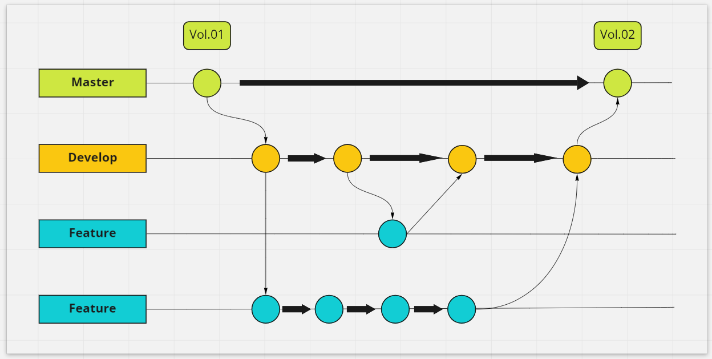
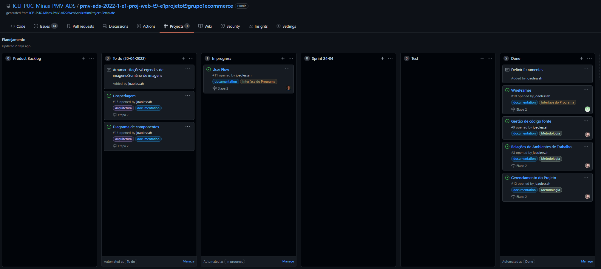

# Metodologia

Pré-requisitos: <a href="2-Especificação do Projeto.md"> Documentação de Especificação</a>

Descreva aqui a metodologia de trabalho do grupo para atacar o problema. Definições sobre os ambiente de trabalho utilizados pela  equipe para desenvolver o projeto. Abrange a relação de ambientes utilizados, a estrutura para gestão do código fonte, além da definição do processo e ferramenta através dos quais a equipe se organiza (Gestão de Times).

## Controle de Versão

A ferramenta de controle de versão adotada no projeto foi o
[Git](https://git-scm.com/), sendo que o [Github](https://github.com)
foi utilizado para hospedagem do repositório.

O projeto segue a seguinte convenção para o nome de branches:

- `main`: versão estável já testada do software
- `develop`: versão de desenvolvimento do software
- Para cada nova funcionalidade serão criadas branches locais, que posteriormente serão mergeadas à `develop` e por fim à `main`

*Exemplo da nossa gestão de código:*

<!---->

Quanto à gerência de issues, o projeto adota a seguinte convenção para
etiquetas:

- `documentation`: melhorias ou acréscimos à documentação
- `bug`: uma funcionalidade encontra-se com problemas
- `enhancement`: uma funcionalidade precisa ser melhorada
- `feature`: uma nova funcionalidade precisa ser introduzida

As tarefas estarão distribuídas no GitHub projects, que estará estruturado da seguinte maneira:

- `Backlog`: todas as atividades que devem ser realizadas no projeto, desde a documentação até o desenvolvimento do e-commerce.
- `To-do` (O todo sempre tem que der a data alterada para o dia inicial daquela sprint semanal): o que está precisa ser feito e que foi definido previamente para aquela sprint.
- `In progress`: O que está sendo feito durante a sprint.
- `Sprint` (aqui a sprint possui a data de fim, também deve ser alterada): Nessa coluna ficam os artefatos produzidos durante a sprint em questão.
- `Test`: O que precisa ser testado.
- `Done`: Tudo o que está pronto independente da sprint.

Ao pegar uma tarefa que estará no To-do, o desenvolvedor, que já estará com o repositório clonado localmente, criará uma branch de feature.

Essa branch sera trabalhada localmente, enquanto a funcionalidade não estiver pronta. Uma vez que estiver pronta, deve-se fazer um commite e posteriormente um merge com a branch `develop`. Feito esse merge o projeto seguirá normalmente. Somente quando uma versão do projeto estiver pronta e testada que haverá um merge com da `develop` com a `main`.

## Gerenciamento de Projeto

### Divisão de Papéis

- **Scrum Master**: Gabriel José Puddo Cardoso
- **Product Owner**: Bruno Franco Soares 
- **Equipe de desenvolvimento**: Arthur Ferreira De Freitas, Breno Lavalle Garrido, João Victor Lessa Henrique, Gabriel Aston Ferreira Costa
- **Equipe de design**: Laura Santos Andrade

### Processo

O projeto será gerenciado pelo GitHub projects, assim como a marcação das entregas, também feita pelo próprio GitHub.

Abaixo, a forma que nosso Kanban está organizado:

Os milestones também estão organizados em issues> milestones.

### Ferramentas

As ferramentas empregadas no projeto são:

- Editor de código: vscode
- Ferramentas de comunicação: teams e discord
- Ferramenta para desenho de tela: Figma
- Criação do documento: Google Docs
- Gerenciamento do Projeto: Github Projects
- Repositório do código fonte: Github

O editor de código foi escolhido porque ele possui uma integração com o
sistema de versão. As ferramentas de comunicação utilizadas possuem
integração semelhante e por isso foram selecionadas. Por fim, para criar
diagramas utilizamos essa ferramenta por melhor captar as
necessidades da nossa solução.

Por se tratar de uma ferramenta de trabalho em equipe, escolhemos o google docs como local de produção do documento. Para gestão do projeto e repositório remoto, escolhemos o GitHub pela integração com a universidade.
