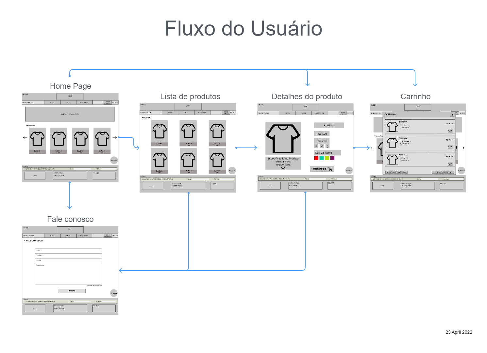
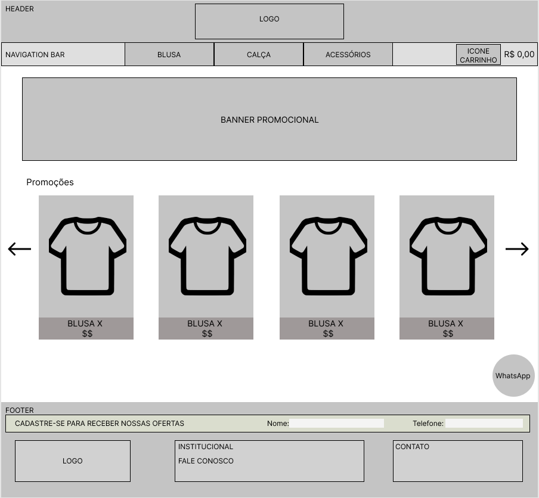
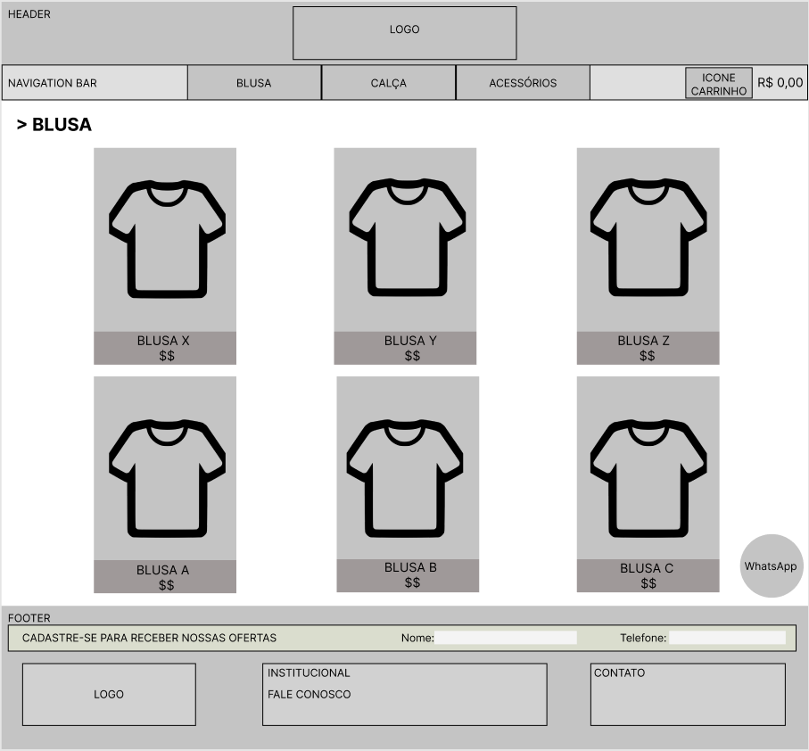
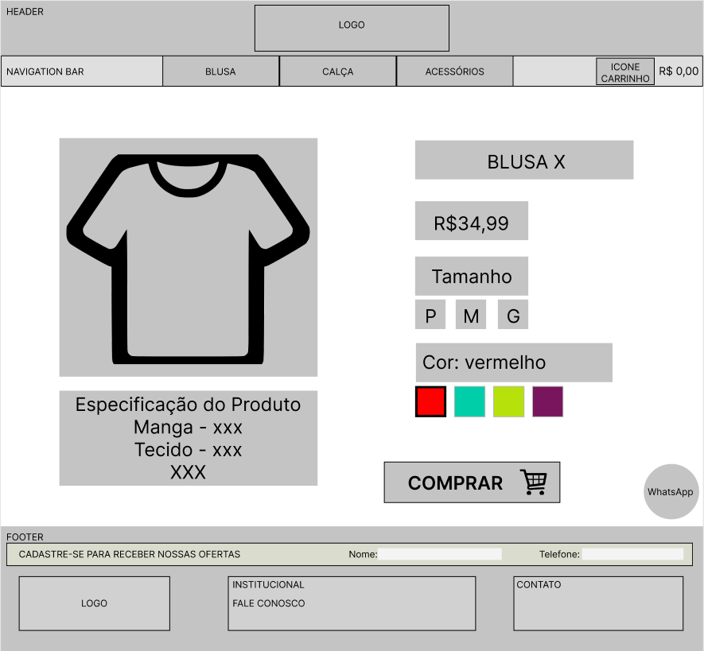
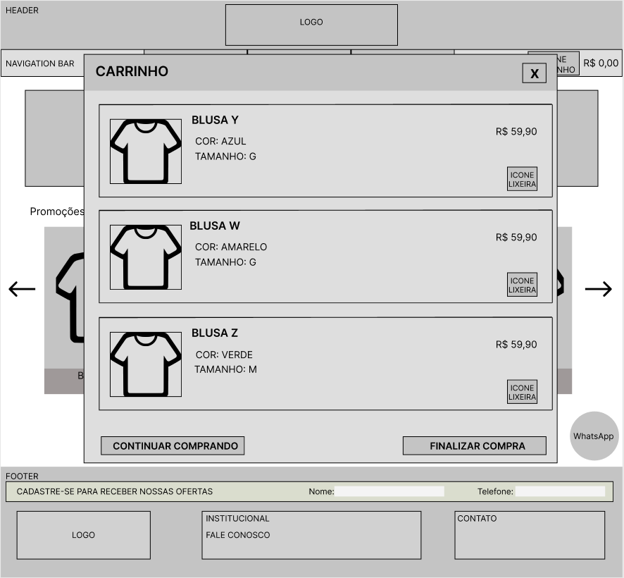
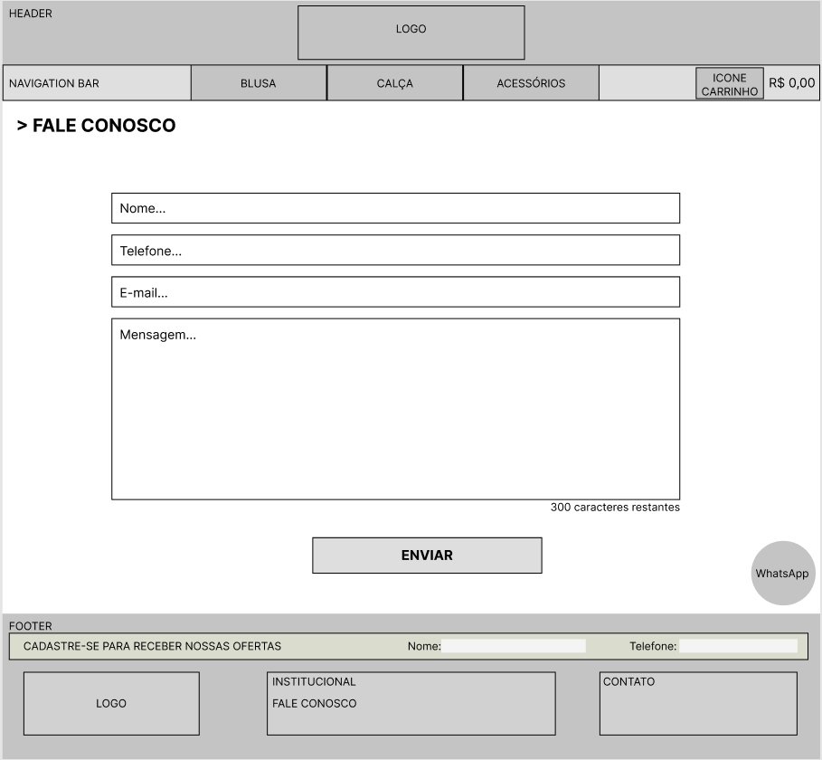

# Projeto de Interface

Pré-requisitos: <a href="2-Especificação do Projeto.md"> Documentação de Especificação</a>

Visão geral da interação do usuário pelas telas do sistema e protótipo interativo das telas com as funcionalidades que fazem parte do sistema (wireframes).

## User Flow

## Wireframes

O detalhamento das telas do site possuem 3 grandes blocos:
- Cabeçalho: local onde conterá elementos fixos como logo, navegação (navigation bar) e acesso ao carrinho de compra;
- Conteúdo: contém banners informativos, lista de produtos, botão flutuante para contato via WhatsApp e o restante do conteúdo;
- Rodapé: apresenta a logo, formas de contato e cadastramento para recebimento de informações.

### Home Page

### Lista de Produtos

### Detalhe Produto

### Carrinho

### Fale Conosco

