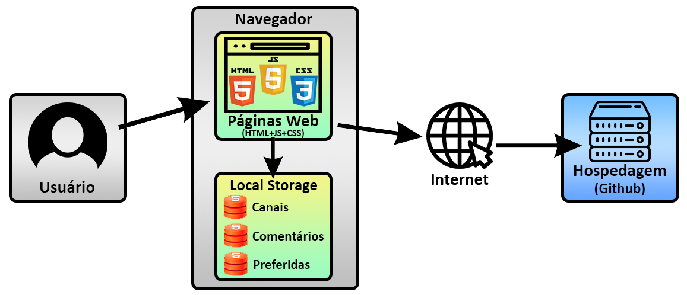

# Arquitetura da Solução

Pré-requisitos: <a href="3-Projeto de Interface.md"> Projeto de Interface</a>

Definição de como o software é estruturado em termos dos componentes que fazem parte da solução e do ambiente de hospedagem da aplicação.

## Diagrama de componentes

Os componentes que fazem parte da solução são representados no esquema abaixo.

Esta solução conta com os seguintes módulos:

**Clientes**   -  consumidor final do sistema 

**Navegador** - Interface básica do sistema
   - Páginas Web - Conjunto de arquivos HTML, CSS, JavaScript e imagens que implementam as funcionalidades do sistema.

**Local Storage** - armazenamento mantido no Navegador, onde são 
implementados bancos de dados baseados em JSON. 

- São eles:
  - Carrinho - armazenará os produtos que o cliente irá comprar 
  - Produtos -  irá armazenar todas  as informações dos produtos 

**Hospedagem** - local na Internet onde as páginas são mantidas e acessadas pelo 
navegador.

## Hospedagem

O site utiliza a plataforma do Github Pages  como ambiente de hospedagem do site do projeto. O site é mantido no ambiente da URL: 

https://github.com/ICEI-PUC-Minas-PMV-ADS/pmv-ads-2022-1-e1-proj-web-t9-e1projetot9grupo1ecommerce
