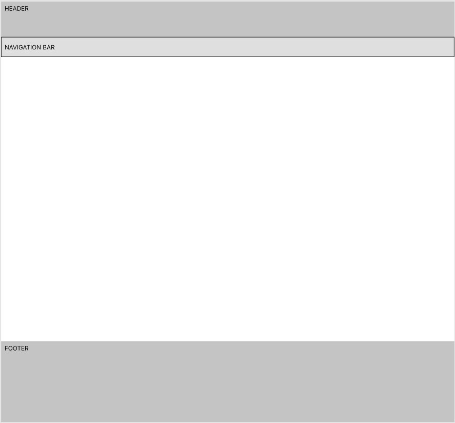
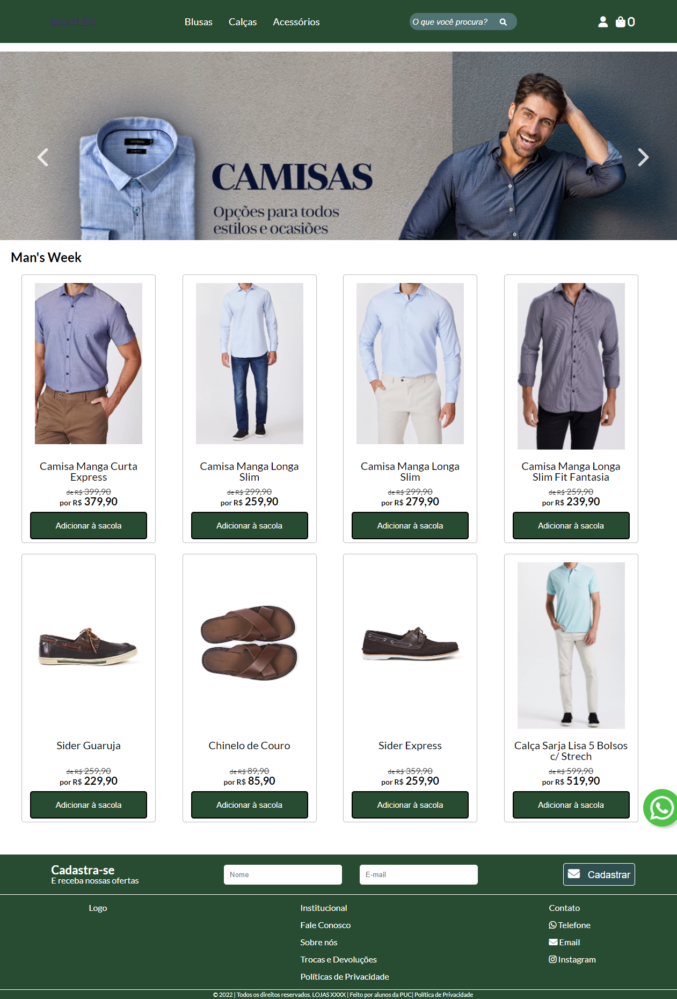
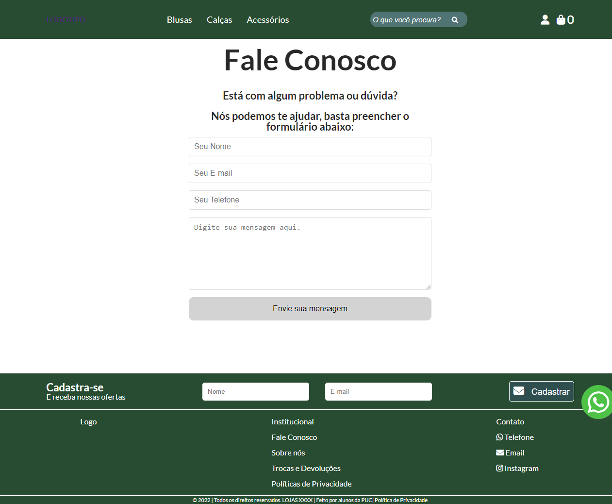
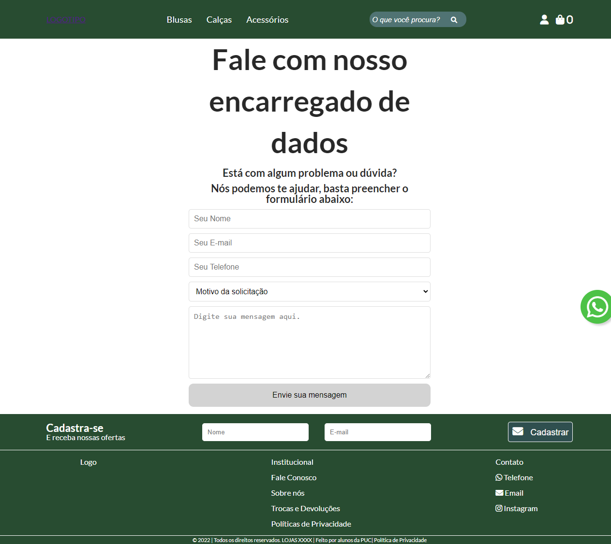
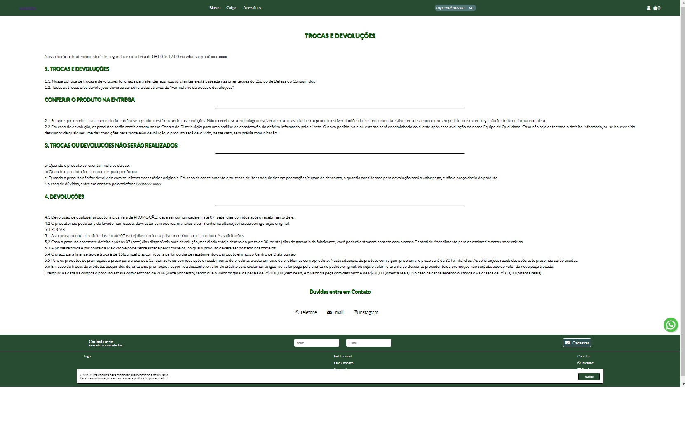

# Template do Site

<!-- Pré-requisitos: <a href="3-Projeto de Interface.md"> Projeto de Interface</a> -->

O layout que foi seguido para a realização do site tem correspondência ao projeto de interface elaborado anteriormente, apresentado no tópico 6 deste documento:

Figura 13 - Layout base do site

O template criado está disponível no site: https://github.com/ICEI-PUC-Minas-PMV-ADS/pmv-ads-2022-1-e1-proj-web-t9-e1projetot9grupo1ecommerce/blob/main/docs/04-Projeto%20de%20Interface.md e contém as seguintes páginas:

<ul>
<li>Tela principal;</li>
<li>Fale Conosco;</li>
<li>Fale com o encarregado de dados;</li>
<li>Página de troca e devolução.</li>
</ul>

## Tela principal:

Tela que contém a base do site, onde, a partir dela, conseguimos navegar por toda a aplicação. Nela possuímos um banner de promoções e os principais produtos em destaque. 

Figura 14 - Página Inicial

## Fale Conosco:
Página destinada à entrada de contato do cliente com a loja para reclamações, sugestões ou solicitar suporte:
	

Figura 15 - Página de Fale Conosco

## Fale com o encarregado de dados:
Por conta da LGPD, precisamos que exista uma página para que o usuário possa entrar em contato com o Encarregado de Dados do site.

Figura 16 - Página fale conosco dados

## Página de troca e devolução: 
Os clientes precisam ter contato com a política de devolução

Figura 17 - Página de trocas e devolução