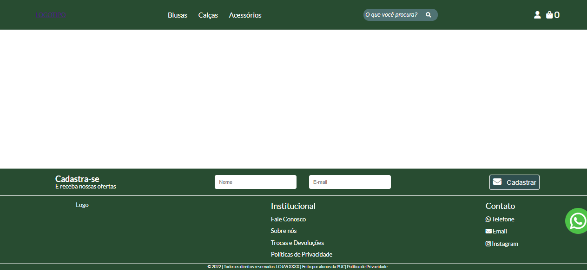
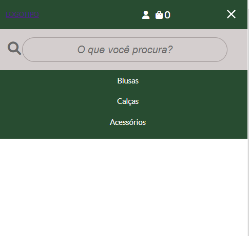
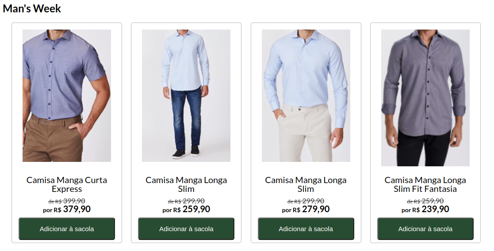
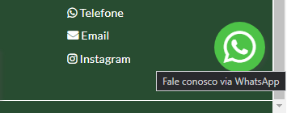
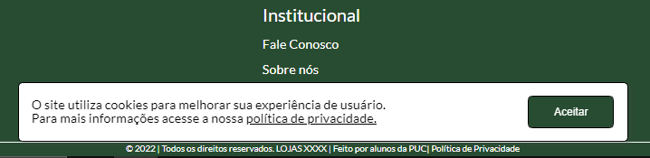

# FUNCIONALIDADES DO SISTEMA (TELAS)

Nesta seção serão apresentadas as telas desenvolvidas para cada uma das funcionalidades do sistema, especificadas durante os Requisitos Funcionais.

Para uma melhor organização do projeto resolveu criar um header e um footer que seriam utilizados em todos os ambientes, ambos são chamados a partir de um ID na tela. Eles são gerados por um script feito com JavaScript utilizando a biblioteca do Jquery.

Com o intuito de facilitar a visualização do que foi feito, criamos uma página de modelo em que para criar outras páginas genéricas, basta pegar o modelo e copiar para dentro de uma pasta de trabalho:

## Header e Footer (RF-01/ RF-04/ RF-05/ RF-06)

Figura 18 - Cabeçalho e rodapé

### Requisitos atendidos:
<ul>
<li>RF-01 - Header página inicial</li>
<li>RF-04 - Footer Cadastro Recebimento Promoção</li>
<li>RF-05 - Footer Bloco para Logo/ Fale Conosco/ Contato</li>
<li>RF-06 - Footer Copyright</li>
</ul>

### Artefatos da Funcionalidade:
<ul>
<li>footer.html</li>
<li>header.html</li>
<li>header.css</li>
<li>footer.css</li>
<li>reset.css</li>
<li>esqueleto.css</li>
<li>header.js</li>
<li>index.js</li>
</ul>

## Header Responsivo
Feito com CSS, Javascript e um pouco de Jquery para fazer a animação.

Figura 19 - Menu responsivo

### Artefatos da Funcionalidade:
<ul>
<li>header.html</li>
<li>header.css (parte de media query)</li>
<li>reset.css</li>
<li>esqueleto.css</li>
<li>header.js</li>
</ul>

## Banner promocional (RF-2)
O banner promocional leva a característica de um carrossel, alternando entre as principais promoções e campanhas de marketing da loja.

Figura 20 - Banner promocional

### Requisitos atendidos:
<ul>
<li>RF-2 - Main banner</li>
</ul>

### Artefatos da Funcionalidade:
<ul>
<li>index.html</li>
<li>banner.css</li>
<li>banner.js</li>
</ul>

## Vitrine de Produtos (RF-3)
A vitrine de produtos exibirá, na página principal, todos os produtos em promoção e suas informações principais.

Figura 21 - Vitrine de produtos
### Requisitos atendidos:

<ul>
<li>RF-3 - Vitrine de Produtos</li>
</ul>

### Artefatos da Funcionalidade:
<ul>
<li>index.html</li>
<li>produtos.html</li>
<li>produtos.js</li>
<li>produtos.css</li>
</ul>

## Página Trocas e Devoluções  (RF-13)
A tela de “Trocas e Devoluções” possui as normas e política de trocas e devoluções da empresa  permitindo ao usuário se informar caso seja necessário alguma troca ou devolução.

Figura 22 - Página de Troca e Devoluções

### Requisitos atendidos
<ul>
<li>RF-013</li>
</ul>

### Artefatos da Funcionalidade
<ul>
<li>trocas.html</li>
<li>trocas.css</li>
</ul>

## Página Fale Conosco (RF-10)

A Tela  “fale conosco” possui um formulário contendo: nome, e-mail, telefone e um espaço para texto permitindo ao usuário entrar em contato caso tenha alguma dúvida.

Figura 23 - Página de Fale Conosco

### Requisitos atendidos

<ul>
<li>RF-010</li>
</ul>

### Artefatos da Funcionalidade
<ul>
<li>fale-conosco.html</li>
<li>fale-conosco.css</li>
</ul>

## Botão WhatsApp (RF-7)
O botão flutuante do WhatsApp permite que o usuário seja redirecionado diretamente para o número da loja com a frase pré-programada “Preciso de ajuda no site”. Permitindo assim que o usuário tire dúvidas sobre funcionalidades do site e outras questões referentes à loja.

Figura 24 - Botão flutuando Fale Conosco via WhatsApp

### Requisitos atendidos
<ul>
<li>RF-7 - Botão flutuante WhatsApp</li>
</ul>

### Artefatos da Funcionalidade
<ul>
<li>footer.html</li>
<li>footer.css</li>
</ul>

## Colher Aceite Termos (RF-8)
Aviso onde usuário confirma que aceita a política de privacidade e cookies do site.

Figura 25 - Pop-up Aceite de Termos

### Requisitos atendidos
<ul>
<li>RF-8 - Colher aceite termos</li>
</ul>

### Artefatos da Funcionalidade
<ul>
<li>footer.html</li>
<li>footer.css</li>
</ul>

## Instruções de acesso do projeto
<ul>
<li>Faça o download do arquivo do projeto (ZIP) ou clone do projeto no GitHub;</li>
<li>Descompacte o arquivo em uma pasta específica;</li>
<li>Abra o Visual Studio Code e execute o Live Server;</li>
<li>Abra um navegador de Internet e informe a seguinte URL: http://127.0.0.1:5500/index.html</li>
</ul>